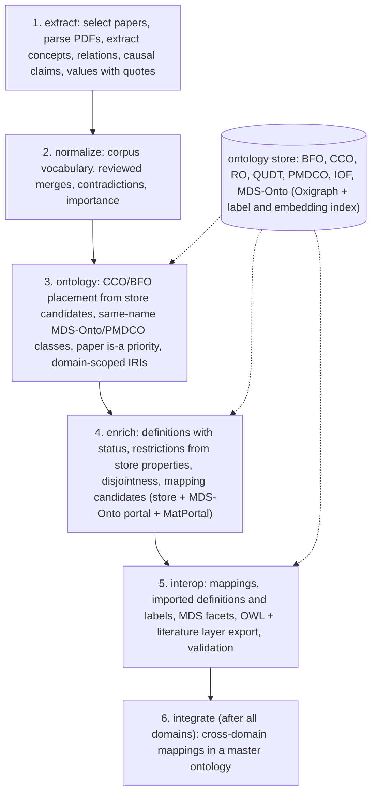

# Knowledge Workflow

Builds draft domain ontologies from curated photovoltaics literature and connects them. For each Zotero collection the pipeline extracts concepts and claims from every paper with verbatim evidence, joins them into a corpus vocabulary, places them under BFO/CCO, enriches and maps them, and exports an OWL ontology plus a literature layer that keeps every claim with its source. A final stage maps the domain ontologies of one run set to each other in a master ontology. The output is a starting point for domain-expert review, not a finished ontology.

## Pipeline



| Stage | Command | Agent | Main outputs | Details |
|---|---|---|---|---|
| Extract | `extract` | extraction | `papers/*.json` | [docs/stages/1-extract.md](docs/stages/1-extract.md) |
| Normalize | `normalize` | normalization | `normalized/`, `corpus_report.md` | [docs/stages/2-normalize.md](docs/stages/2-normalize.md) |
| Ontology | `ontology` | ontology | `ontology/classes.json` | [docs/stages/3-ontology.md](docs/stages/3-ontology.md) |
| Enrich | `enrich` | enrichment | `ontology/enriched.json` | [docs/stages/4-enrich.md](docs/stages/4-enrich.md) |
| Interop | `interop` | interoperability | `ontology.ttl`, `domain_layer.ttl`, `ontology_report.md` | [docs/stages/5-interop.md](docs/stages/5-interop.md) |
| Integrate | `integrate` | integration | `integration-*/<domains>.ttl`, `integration_report.md` | [docs/stages/6-integrate.md](docs/stages/6-integrate.md) |
| Ontology store | `ontologies build` | | `outputs/cache/ontology_store/` | [docs/ontology-store.md](docs/ontology-store.md) |
| Reporting | (every stage) | | `run.json`, `eval_runs.csv`, `eval_integrations.csv` | [docs/stages/7-reporting.md](docs/stages/7-reporting.md) |

The stage order is fixed in ordinary Python (`src/run.py`); no model decides what runs next. Each agent has its own prompt and JSON schema (`src/resources/prompts`, `src/resources/schemas`) and writes its artifact before the next stage reads it.

## Setup

```powershell
uv venv
uv pip install --python .venv\Scripts\python.exe -r requirements.txt
Copy-Item .env.example .env   # then add your Zotero, MDS-Onto, MatPortal and model keys
```

Keep Ollama running with the configured local model (`kw-qwen3.5-9b-32k`) and embedding model (`nomic-embed-text`). Build the ontology store once (downloads missing ontology files, the latest MDS-Onto from its portal, and embeds every term; rebuild after a source or embedding-model change):

```powershell
uv run --with-requirements requirements.txt python -m src.run ontologies build
```

Credentials, environments, caches, PDFs and results are excluded from Git.

Runtime caches: successful downstream JSON calls are reused only for the same input, prompt/schema, model,
provider settings and workflow revision. Incomplete row batches and schema echoes are not cached. Reused calls
record zero new compute in the ledger and retain their originating run, item and usage in `calls.jsonl`.
Use a new model name or workflow revision when replacing chat weights under an existing model name.
Embeddings are deduplicated and persisted in `outputs/cache/embeddings.sqlite3`, keyed by endpoint, model,
`EMBED['cache_version']` and text. Bump the cache version when replacing an embedding model under the same name.
Successful empty portal searches expire after one day; failed requests are never cached.
`--limit` stops PDF acquisition as soon as enough ranked, available papers have been found. Extraction packs
adjacent short sections up to 6,000 characters while retaining headings, captions, evidence checks and all text.

## Running

```powershell
# one domain, all stages
uv run --with-requirements requirements.txt python -m src.run all --collection tea --limit 5

# three domains, then the cross-domain stage
$cols = "tea","reliability","si-topcon"
foreach ($c in $cols) {
    uv run --with-requirements requirements.txt python -m src.run all --collection $c --limit 5
    if ($LASTEXITCODE -ne 0) { break }
}
if ($LASTEXITCODE -eq 0) { uv run --with-requirements requirements.txt python -m src.run integrate --collections @cols }

# figures and the grouped report (report.md, report.html, sweep_summary.csv) -> outputs/figures/<revision>/
# written automatically after every finished run (<run>/figures/) and integration (<integration>/figures/ and
# outputs/figures/<revision>/); --no-figures skips that
uv run --with-requirements requirements.txt python -m src.figures
uv run --with-requirements requirements.txt python -m src.figures --runs RUN_ID RUN_ID --out outputs/figures/mine

# resume a run (skips completed stages); preflight checks
uv run --with-requirements requirements.txt python -m src.run all --run-id tea-YYYYMMDD-HHMMSS
uv run --with-requirements requirements.txt python -m src.run check --collection tea
```

**Model profiles** (`LLM_PROFILE`, `src/config.py`): `ollama` (default, local tier), `ollama-lora`, `gemini`, `gemini-lite`, `deepseek`, `groq`, `anthropic`. Local-tier profiles split each stage into narrow single-task calls; frontier profiles use one combined call per batch. With `gemini` or `gemini-lite`, extraction and interop stay on Ollama and normalization, ontology and enrichment use Gemini with quota pacing ([GEMINI.md](GEMINI.md), [GEMINI_HYBRID.md](GEMINI_HYBRID.md)). Sampling temperature is left at each provider's default.

## Error checking and validity

What the pipeline checks, and what it does not establish:

- **Evidence.** Every relation, causal claim and measurement carries a quote of at most 20 words. Quotes are checked against the parsed paper (80% of word 3-grams, normalised) and marked `verified`, `unverified` or, after one re-ask, `unevidenced`. A found quote shows the text exists, not that it supports the claim. Unevidenced items never become axioms.
- **Model output.** Every call must return JSON for a fixed schema; one retry, then the pass is skipped and counted. Answers wrapped in a copy of the schema are unwrapped. Rows the model leaves out are sent once more, and coverage is reported per pass, because missing rows otherwise become silent defaults.
- **Deterministic guards.** Unknown ids never become concepts; free-text types map onto a fixed enum; measurements separate property and entity; external terms reach the model only as candidates retrieved from the ontology store, and answers outside them are dropped; placement checks categories, cycles, paper is-a evidence and lexical heads; restrictions must trace to an extracted relation and fit the property's domain and range; mappings claiming identity need matching names, OWL axioms need a matching BFO category, a mapped store term must not be deprecated, and portal terms outside the store (any ontology the MDS-Onto portal or MatPortal hosts) get SKOS mappings only; cross-domain equivalence never joins two classes of one domain.
- **Uncertain items.** What the checks drop or leave unsure is listed item by item in each run's `ontology/uncertain.json` (unresolved relation ends, rows still unanswered after the retry, parent answers that name nothing offered, dropped restrictions with the reason, portal terms missing from the store, screened, downgraded and dropped mappings), with counts in `eval_runs.csv` (`uncertain_*`).
- **Structural validation** of each ontology and of the master ontology (declarations, round trip, cycles, BFO connectivity). It shows the files are well formed, not that their content is correct. No reasoner is run.
- **Provenance and comparability.** Each run records profile, model and tier per agent, corpus hash, workflow revision and per-call compute. Runs are comparable within one revision and profile; model calls are not deterministic, so the same input can give different output.
- **Not established by any of this:** extraction completeness, correctness of definitions, parents and mappings, and agreement with experts. Those need the evaluation protocol (expert review, model-based judging calibrated on a hand-annotated subset).

## Configuration

`src/config.py` holds everything except keys: profiles and routing (`PROFILES`, `AGENT_PROFILES`, `PIPELINE_TIER`, `AGENT_MODELS`), embeddings (`EMBED`), collections (`COLLECTIONS`, `TOP_N_BY_CITATIONS`), ontology store (`ONTOLOGY_SOURCES`, `ONTOLOGY_STORE`, `ONTOLOGY_SEARCH`), portals (`MDS_ONTOLOGIES`, `MATPORTAL`), mapping thresholds (`MAPPING`), integration (`INTEGRATION`), definition policy (`MODEL_DEFINITION_PROFILES`), LoRA data (`LORA`), output IRIs and `WORKFLOW_REVISION`. See [ONTOLOGY_REVISION.md](ONTOLOGY_REVISION.md) for what each revision changed.

## Optional: local model adapter

`python -m src.run lora-data` builds LoRA training data from BFO, CCO and QUDT with the pipeline's own prompts; `src/resources/lora/` has local (WSL2) and Colab training; `python -m src.run lora-eval --model NAME` scores base against adapter. The four evaluation collections are never used as training data.

## History

This repository replaced the earlier `kw/` and Kweave implementations on 2026-10-03; their code remains in Git history (branch `legacy/pre-opus-20261003`).
