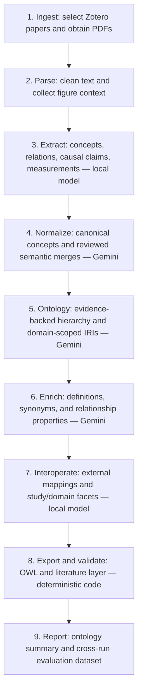

# Knowledge Workflow

This repository now contains the implementation migrated from `opus_knowledge_workflow`. The former `kw/` and Kweave implementations are deprecated; their committed history remains available in Git. New development and runs use this checkout.

The pipeline selects literature from Zotero, extracts concepts and claims, normalizes them, builds and enriches a domain ontology, and exports OWL JSON-LD/Turtle plus an evidence-preserving literature layer. Run reports and the cross-run eval dataset remain local under `outputs/`.

## Workflow

The five CLI stages are `extract`, `normalize`, `ontology`, `enrich`, and `interop`. Ingestion and parsing happen inside extraction; export and structural validation happen inside interoperability. The model labels below apply when using the `gemini` or `gemini-lite` hybrid profile.



1. **Ingest:** Read the selected Zotero collection, rank papers by citation count, choose papers with accessible PDFs, and cache their metadata and files.
2. **Parse:** Extract PDF text, remove references and repeated headers, split text into processing sections, and collect figure captions and citing sentences. This step uses code rather than a model.
3. **Extract (`extract`):** Identify concepts, non-causal relations, causal claims, measured values, units, conditions, and figure links. Keep source quotes, check quote overlap against the paper, and cache completed paper extractions.
4. **Normalize (`normalize`):** Group matching normalized labels, use local embeddings to nominate similar concepts, and ask Gemini to review semantic merges. Aggregate evidence and relations, flag opposite causal polarities, settle type conflicts, and rank concepts by importance.
5. **Ontology (`ontology`):** Select corpus or BFO/CCO parents using definitions and relationship context. Prioritize verified `is_a` edges when categories agree and cycles are avoided; flag unresolved placements and conflicts. Assign domain-scoped class IRIs with deterministic identity hashes.
6. **Enrich (`enrich`):** Write evidence-supported definitions, filter synonym candidates, select properties for universal non-causal restrictions, and propose disjoint siblings. Add causal restrictions with provenance, retrieve external mapping candidates, and save review issues and cross-domain correspondence candidates. Conditional literature claims remain available in the separate literature layer.
7. **Interoperate (`interop`):** Review external term candidates, choose mappings, and assign study-stage and domain facets. Same-label cross-domain candidates are review suggestions and do not automatically assert equivalence.
8. **Export and validate:** Assemble and serialize the BFO/CCO-aligned OWL ontology as Turtle and JSON-LD. Also export the literature layer containing concepts, claims, conditions, evidence, and reported values. Structural checks cover declarations, hierarchy cycles, BFO connectivity, and JSON-LD round-trip counts; they do not establish semantic accuracy or reasoner consistency.
9. **Report:** Record per-call and per-paper compute, corpus and ontology summaries, provenance, review flags, and cross-run metrics in `outputs/eval_runs.csv`. Reporting updates throughout the run; the final stage completes the ontology report. New runs carry the workflow revision, and the first run of a revision adds a separate change-event row.

## Setup and run

```powershell
uv venv
uv pip install --python .venv\Scripts\python.exe -r requirements.txt
Copy-Item .env.example .env
```

Edit `.env` locally with the credentials required by your providers and Zotero. Skip the copy if `.env` already exists. Credentials, runtime environments, caches, PDFs, and generated results are excluded from Git.

For Gemini hybrid routing, keep Ollama running with the configured local model and embedding model:

```powershell
$env:LLM_PROFILE = "gemini"  # or gemini-lite
.\.venv\Scripts\python.exe -m src.run all --collection si-topcon --limit 1
```

Extraction and interoperability run locally. Normalization, ontology, and enrichment use Gemini with persistent quota accounting. See [Gemini setup](GEMINI.md), [hybrid routing](GEMINI_HYBRID.md), and [ontology revision](ONTOLOGY_REVISION.md).

Start a new run without `--run-id` to use the latest workflow revision and preserve older results. Its first run adds a workflow-change event to the local eval dataset. Structural validation is included; semantic correctness and reasoner validation are not established by that check.

## Migration

The migration preserves the existing GitHub repository and history. `legacy/pre-opus-20261003` records the pre-migration commit. The original checkout's files, uncommitted changes, credentials, environment, and outputs were preserved locally at `C:\Users\brent\dev\knowledge_workflow_legacy_20261003`. The Opus folder remains untouched as the source copy.

Existing Opus outputs and quota state were copied into this checkout locally. Legacy outputs remain in the separate backup. No tests or live model requests were run during migration. A hardcoded demo-key fallback was removed before publication; callers must supply their configured MDS API key.
